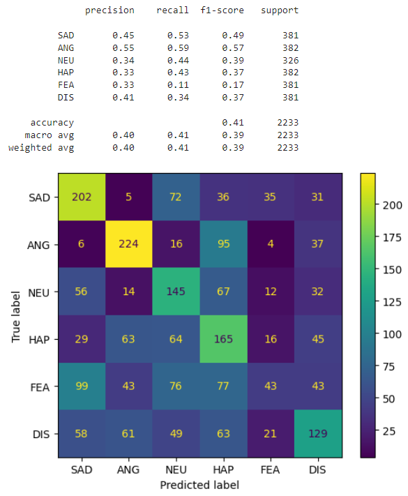
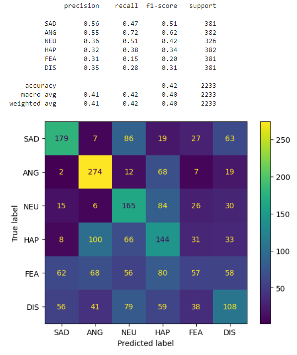
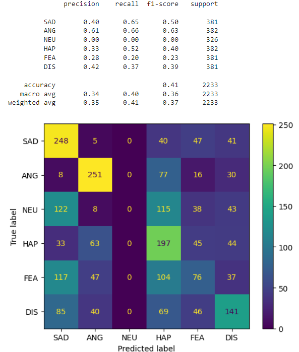
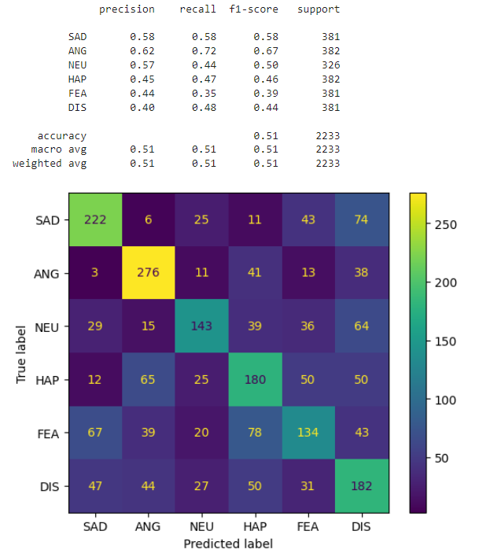
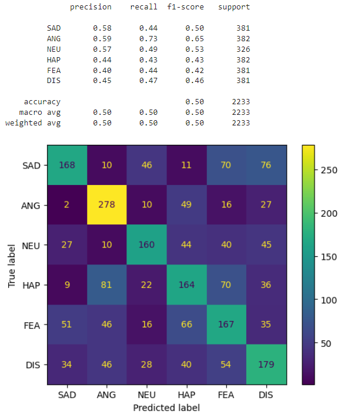
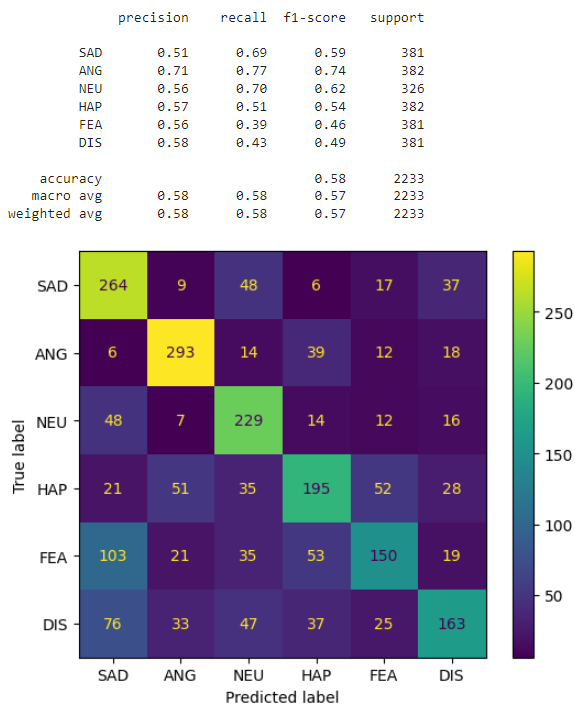

# Speech Emotion Recognition
Speech is the most natural way of expressing ourselves as humans. It is only natural then to extend this communication medium to computer applications. We define speech emotion recognition (SER) systems as a collection of methodologies that process and classify speech signals to detect the embedded emotions. 

This project is an exploration of different audio features and CNN-based architectures for building an effective Speech Emotion Recognition (SER) system. The goal is to improve the accuracy of detecting emotions embedded in speech signals. The repository contains code, notebooks, and detailed explanations of the experiments conducted, including feature extraction techniques, model architectures, training procedures, and evaluation metrics. Contributors interested in speech processing and emotion recognition are welcome to explore and contribute to this project.

**Note:** This README.md file contains an overview of the project, it is recommended to open [notebook](https://github.com/yousefkotp/Speech-Emotion-Recognition/blob/main/main.ipynb) as it contains the code and further explanation for the results.

## Table of Contents
- [Speech Emotion Recognition](#speech-emotion-recognition)
  - [Dataset](#dataset)
    - [Preprocessing](#preprocessing)
    - [Data Augmentation](#data-augmentation)
    - [Data Splitting](#data-splitting)
  - [Features Extraction](#features-extraction)
  - [Building the Models](#building-the-models)
    - [DummyNet](#dummynet)
      - [Model Architecture](#model-architecture)
      - [Using Zero Crossing Rate](#using-zero-crossing-rate)
      - [Using Energy](#using-energy)
      - [Using Zero Crossing Rate and Energy](#using-zero-crossing-rate-and-energy)
      - [Using Mel Spectrogram](#using-mel-spectrogram)
    - [RezoNet](#rezonet)
      - [Model Architecture](#model-architecture-1)
      - [Training](#training)
      - [Classification Report](#classification-report)
    - [ExpoNet](#exponet)
      - [Model Architecture](#model-architecture-2)
      - [Training](#training-1)
      - [Classification Report](#classification-report-1)
  - [Remarks](#remarks)
  - [Results](#results)
  - [Contributors](#contributors)

## Dataset
CREMA (Crowd-sourced Emotional Multimodal Actors Dataset) is a dataset of 7,442 original clips from 91 actors. 7442 samples may be considered a relatively moderate-sized dataset for speech emotion recognition. These clips were from 48 male and 43 female actors between the ages of 20 and 74 coming from a variety of races and ethnicities (African America, Asian, Caucasian, Hispanic, and Unspecified). Actors spoke from a selection of 12 sentences. The sentences were presented using one of six different emotions (Anger, Disgust, Fear, Happy, Neutral, and Sad). The [dataset](https://www.kaggle.com/datasets/dmitrybabko/speech-emotion-recognition-en) is available on Kaggle.

Speech emotion recognition typically requires a substantial amount of labeled data for training accurate models. Deep learning models, such as those based on convolutional neural networks (CNNs) or recurrent neural networks (RNNs), often benefit from large amounts of data to generalize well and capture complex patterns in speech signals.

While 7,442 samples can provide a good starting point for training a speech emotion recognition model, having access to a larger dataset is generally desirable. More data can help improve the model's performance, reduce overfitting, and enhance its ability to generalize to unseen data.

It's worth noting that the quality and diversity of the data also play a crucial role. If the 7,442 samples are diverse, covering a wide range of speakers, languages, emotions, and recording conditions, they can be more valuable than a larger dataset with limited variability.


### Preprocessing
Since that the audio files don't have the same length, we will pad them with zeros to make them all of the same length to match the length of the largest audio file in the dataset. We will also make sure that all the audio files have the same sampling rate (16 KHz) by resampling them if needed.

### Data Augmentation
Data augmentation is a common technique for increasing the size of a training set by applying random (but realistic) transformations to the audio samples. This helps expose the model to more aspects of the data and generalize better. For speech emotion recognition. For this project, we will use the following data augmentation techniques:
- **Noise Injection:** Adding random noise to the audio signal can help the model learn to be more robust to noise in the input signal.
- **Time Shifting:** Shifting the audio signal in time can help the model learn to be more robust to temporal shifts in the input signal.
- **Pitch Shifting:** Shifting the pitch of the audio signal can help the model learn to be more robust to changes in the pitch of the input signal.
- **Time Stretching:** Stretching or compressing the audio signal in time can help the model learn to be more robust to changes in the speed of the input signal.
- **Volume Scaling:** Scaling the volume of the audio signal can help the model learn to be more robust to changes in the volume of the input signal.

### Data Splitting
For the data splitting, we will use the following ratios:
- Training Set: 70%
- Testing Set: 30%
- Validation Set: 5% of the Training Set

While the validation set is not used for training the model, it is used for tuning the hyperparameters of the model, such as the learning rate. The validation set is also used for evaluating the model during training to determine when to stop training and prevent overfitting.

## Features Extraction
We will process the audio files (wav files) mainly using `librosa` library. We will extract the following features:
- Zero Crossing Rate
- Energy
- Mel Spectrogram

When selecting the window size and hop size for audio classification tasks using a convolutional neural network (CNN), it's important to consider several factors, including the length of the audio samples, the nature of the audio signal, and the computational resources available. Here are some general guidelines we will follow:

- **Window Size:** The window size determines the amount of audio data that is processed at a time. A larger window size captures more information about the audio signal, but also requires more computational resources. For speech signals, a window size of around 20-30 ms (320-480 samples for 16 kHz audio) is often used, as it captures enough information about individual phonemes while still allowing for some temporal resolution.
- **Hop Size:** The hop size determines the amount of overlap between adjacent windows. A smaller hop size provides more temporal resolution but requires more computational resources, while a larger hop size provides better computational efficiency but can miss short-term changes in the audio signal. A common hop size is half the window size, i.e. 10-15 ms (160-240 samples for 16 kHz audio).
- **Number of Mels:** for the Mel Spectrogram, the number of Mels determines the number of frequency bands that are used to represent the audio signal. A larger number of Mels captures more information about the audio signal, but also requires more computational resources. For speech signals, a number of Mels between 40 and 80 is often used, as it captures enough information about the audio signal while still allowing for some computational efficiency.

Mainly, the general formula for calculating the values of the window size and hop size is as follows:
```python
size (in samples) = duration (in seconds) x fs (sampling rate in Hz)
```
    
For this project, we **mainly** decided to go with the following values:
- Window Size: 512 Samples
- Hop Size: 128 Samples
- Number of Mels: 40 Frequency Bands

## Building the Models

For this project, we will build three new models:
- **DummyNet:** A simple CNN model that takes the raw audio signal as input and uses a series of convolutional layers to extract features from the audio signal. The output of the convolutional layers is then flattened and fed to a series of fully-connected layers to classify the audio signal.
- **RezoNet:** A CNN model that takes the Mel Spectrogram as a 2D input and uses a series of convolutional layers with rectangular kernels to extract features from the audio signal. The output of the convolutional layers is then flattened and fed to a series of fully-connected layers to classify the audio signal.
- **ExpoNet:** A CNN model that takes Zero Crossing Rate, Energy and Mel Spectrogram all flattened together as a 1D input and uses a series of convolutional layers with squared size kernels to extract features from the audio signal. The output of the convolutional layers is then flattened and fed to a series of fully-connected layers to classify the audio signal.

### DummyNet
As explained from its name, it is one of the most basic CNN models that takes either Zero Crossing Rate, Energy or both or even flattened Mel Spectogram as input.

#### Model Architecture
- First Convolutional Layer: 1D convolutional layer with 1 input channel, 512 output channels, and a kernel size of 5 and stride of 1.
- First Pooling Layer: Max pooling layer with a kernel size of 5 and stride of 2.
- Second Convolutional Layer: 1D convolutional layer with 512 input channels, 512 output channels, and a kernel size of 5 and stride of 1.
- Second Pooling Layer: Max pooling layer with a kernel size of 5 and stride of 2.
- Third Convolutional Layer: 1D convolutional layer with 512 input channels, 128 output channels, and a kernel size of 5 and stride of 1.
- Third Pooling Layer: Max pooling layer with a kernel size of 5 and stride of 2.
- Flatten: Flattens the input tensor to a 1-dimensional vector.
- First Fully Connected Layer: Fully connected (linear) layer with an input size of `input shape` * 128 and an output size of 256.
- Second Fully Connected Layer: Fully connected (linear) layer with an input size of 256 and an output size of 6.
- Softmax activation is applied to the last layer to produce the output probabilities.

RELU activation is applied to the output of each convolutional and fully connected layer, except for the last layer.

#### Using Zero Crossing Rate

<p align="center">
  
</p>

#### Using Energy

<p align="center">
  
</p>

#### Using Zero Crossing Rate and Energy

<p align="center">
  
</p>

#### Using Mel Spectrogram

<p align="center">
  
</p>


### RezoNet
RezoNet is a Deep-Net A Lightweight CNN-Based Speech Emotion Recognition Model. It consists of a group of different rectangular shaped kernels in convolutional layer and pooling layer. The model is inspired from the research [Deep-Net: A Lightweight CNN-Based Speech Emotion Recognition System Using Deep Frequency Features](https://www.mdpi.com/1424-8220/20/18/5212). The model is trained on 2D Mel Spectrogram features extracted from the audio files.

#### Model Architecture

<p align="center">
  
</p>

#### Training
For audio processing, we used window size = 512, hop size = 160 and number of mel = 40. We used Adam optimizer with learning rate = 0.00001 and batch size = 16. We trained the model for 86 epochs and saved the best model based on validation accuracy. We used learning rate decay after 50 epochs with decay rate = 0.1. We used L2 regularization with weight decay = 0.01.

After analysis, it turns out that the model is overfitting. We tried to solve this problem by using data augmentation techniques. We used noise injection, time shifting, pitch shifting, time stretching and volume scaling.

The best checkpoint for the model was saved at epoch 5. We will use this checkpoint for testing.

#### Classification Report

<p align="center">
  
</p>


### ExpoNet

#### Model Architecture
The input to the network is expected to be 1D, representing the speech signal which will contains Zero Crossing Rate appended to Energy and appended to 1D flattened Mel Spectogram.

The network architecture begins with a convolutional layer with 1 input channel, 512 output channels, a kernel size of 5, stride of 1 and same padding. This is followed by a ReLU activation function, batch normalization, and max pooling with a kernel size of 5, stride of 2 and same padding. The shape of the input is updated accordingly.

The process is repeated for four additional convolutional layers with similar configurations but varying number of input and output channels. Each convolutional layer is followed by a ReLU activation, batch normalization, and max pooling layer, with the shape updated after each pooling operation.

After the convolutional layers, the features are flattened using the `nn.Flatten()` module. Then, the flattened features are passed through two fully connected layers with 512 and 6 output units, respectively. The first fully connected layer is followed by a ReLU activation and batch normalization. Finally, the output is passed through a softmax function to obtain the predicted probabilities for each emotion class.

The model can be modified to use `Log Softmax` instead of Softmax for faster computation and practicality reasons. However, using Softmax is not a problem in this case since that we are using a GPU to run the model.

#### Training
For audio processing, we used window size = 512, hop size = 160 and number of mel = 40. We used Adam optimizer with learning rate = 0.00001 and batch size = 8. We trained the model for 10 epochs and saved the best model based on validation accuracy. We used L2 regularization with weight decay = 0.001. We have also used data augmentation techniques such as noise injection, time shifting, pitch shifting, time stretching and volume scaling to prevent overfitting.

#### Classification Report

<p align="center">
  
</p>


## Remarks
- The README.md file contains an overview of the project, it is recommended to open [notebook](https://github.com/yousefkotp/Speech-Emotion-Recognition/blob/main/main.ipynb) as it contains the code and further explanation for the results.

- From all of the previous, it is clear that the best model is ExpoNet. The results can be further improved by using a bigger dataset but we will not be doing that in this project.

- The next step would be to build a two or three layer neural network which will ensemble the previous models and use the output of each model as an input to the neural network. This will help in improving the results even further. However, we don't have the enough time and computational power to do that in this project.

## Results
The results are discussed in further details in the [notebook](https://github.com/yousefkotp/Speech-Emotion-Recognition/blob/main/main.ipynb).

## Contributors

- [Yousef Kotp](https://github.com/yousefkotp)

- [Mohamed Farid](https://github.com/MohamedFarid612)

- [Adham Mohamed](https://github.com/adhammohamed1)
